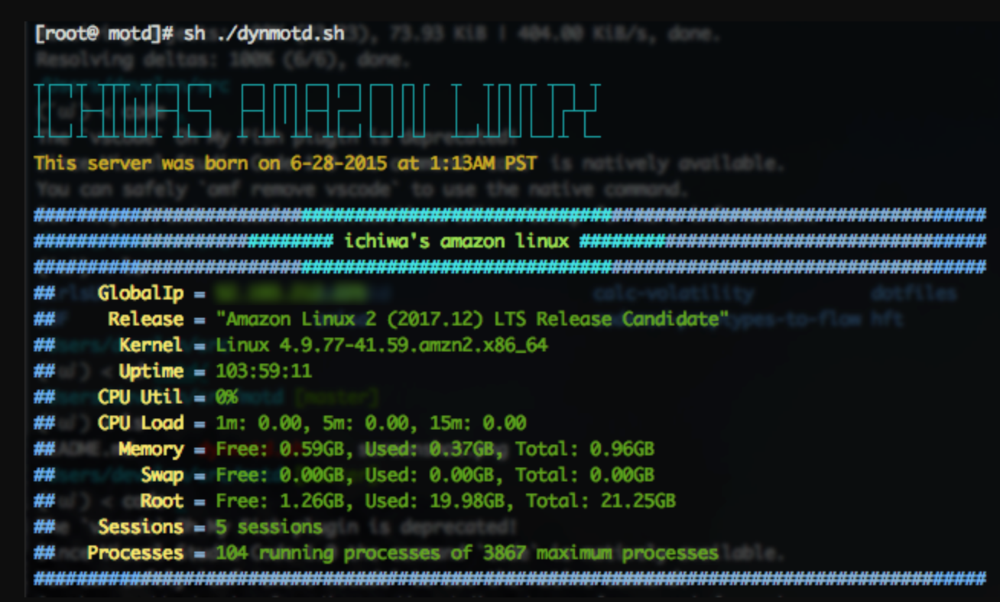

# ichiwa's MOTD

This is forked from [here](https://github.com/samliu/motd).

## Usage

1. `git clone https://github.com/ichiwa/motd.git`
2. `chmod +x ./motd/dynmotd.sh`
3. `mv ./motd/dynmotd.sh /etc/update-motd.d/30-banner`
4. [Create AA](http://patorjk.com/software/taag/#p=display&f=ANSI%20Shadow&t=DEV) and update your banner text.
5. `update-motd --force`
